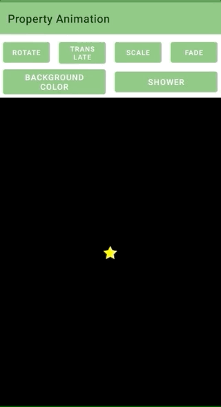

# Android-Property-Animations
A simple app to show some usage examples of property animations in Android. This app shows how to create Property Animations, using `ObjectAnimator`, which are the basic building blocks of most Android animations. Property animations are used to animate (or change over time) the value of a property on an object, usually a UI object like an Android view.

The app shows **6** animations, some fundamental and some more complex.

- **ROTATE** will cause the star to spin in a complete circle.
- **TRANSLATE** will cause the star to move to the right and back.
- **SCALE** will cause the start to scale up and then back down.
- **FADE** will cause the star to fade out to completely transparent and then back to fully opaque.
- **BACKGROUND** COLOR will cause the color of the star’s container to animate between black and red.
- **SHOWER** will create a new star at the top of the starfield, which will then fall downwards while rotating. Every click will create a new star, animating in parallel with the existing stars.

